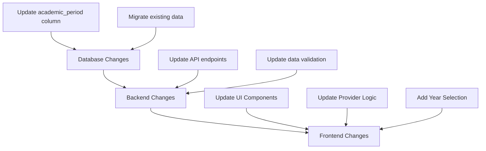

# Academic Period Migration Plan

## Overview
Convert the academic_period field in teacher_course_groups from using descriptive strings ("current", "previous", "next") to actual year values ("2024", "2025", etc.).



## 1. Database Changes

### Schema Update
- Modify `academic_period` column in `teacher_course_groups` table
  - Current: String enum ("current", "previous", "next")
  - New: String representing year ("2024", "2025", etc.)

### Data Migration
Map existing values to years:
- "current" → "2025" (current year)
- "previous" → "2024"
- "next" → "2026"

## 2. Frontend Changes

### Provider Updates
```dart
// Update academicPeriodsProvider
final academicPeriodsProvider = Provider<List<String>>((ref) {
  final currentYear = DateTime.now().year;
  return [
    (currentYear - 2).toString(),
    (currentYear - 1).toString(),
    currentYear.toString(),
    (currentYear + 1).toString(),
    (currentYear + 2).toString(),
  ];
});

// Update initial state
final academicPeriodProvider = StateProvider<String>((ref) => 
  DateTime.now().year.toString());
```

### UI Updates
- Modify period selector dropdown to display years
- Update labels from "Academic Period" to "Academic Year"
- Set default selection to current year
- Ensure proper sorting of year values

## 3. State Management Updates

### TeacherClassesNotifier Changes
- Update initial `_academicPeriod` value to use current year
- Modify period handling logic to work with year values
- Update any period comparison logic
- Ensure proper type handling for year strings

## 4. Testing & Validation

### Database Testing
- [ ] Verify schema update
- [ ] Validate data migration
- [ ] Test constraints and relationships

### Frontend Testing
- [ ] Test year selection UI
- [ ] Verify default year selection
- [ ] Test year filtering
- [ ] Validate data display
- [ ] Check edge cases (year transitions)

### Integration Testing
- [ ] Test full data flow
- [ ] Verify API interactions
- [ ] Test period changes
- [ ] Validate error handling

## 5. Documentation Updates

### API Documentation
- Update API specs for year-based periods
- Document new response formats
- Update example requests/responses

### Migration Guide
- Document schema changes
- Provide rollback procedures
- Include testing guidelines

### User Documentation
- Update UI documentation
- Add notes about year-based system
- Include screenshots of new UI

## Implementation Schedule

1. Database Migration (Day 1)
   - Schema update
   - Data migration
   - Validation

2. Backend Updates (Day 2)
   - API modifications
   - Testing
   - Documentation

3. Frontend Implementation (Days 3-4)
   - Provider updates
   - UI modifications
   - Testing

4. Final Testing & Deployment (Day 5)
   - Integration testing
   - User acceptance testing
   - Deployment
   - Monitoring

## Risks & Mitigation

1. Data Migration
   - Risk: Data loss during migration
   - Mitigation: Backup database before migration, create rollback plan

2. API Compatibility
   - Risk: Breaking changes for existing clients
   - Mitigation: Version API endpoints, provide migration period

3. User Experience
   - Risk: User confusion with new system
   - Mitigation: Clear UI labels, tooltips, documentation