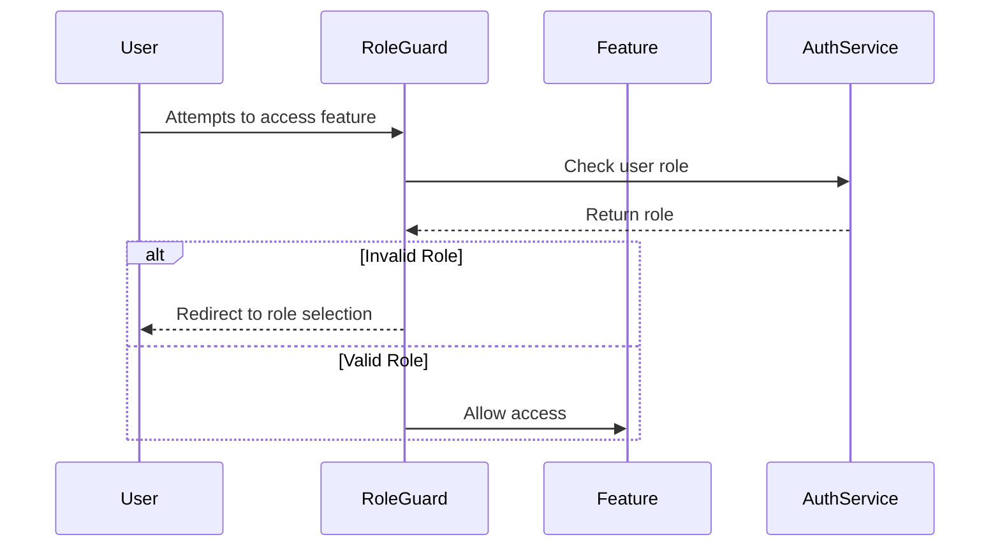

# Authentication Role Verification Fix

## Current Issue
There is a problem with the role-based access control in the application:
- Users' roles (teacher/student) are correctly stored in the database
- The role selection screen shows the correct buttons based on the user's role
- However, there is no role verification when accessing teacher/student features
- This allows students to access teacher features and vice versa if they know the route

## Proposed Solution

### 1. Create RoleGuard Widget
Create a new widget that will:
- Wrap both TeacherFeature and StudentFeature components
- Verify user's role before allowing access
- Redirect unauthorized users back to role selection screen



### 2. Implementation Steps

1. Create RoleGuard Widget:
```dart
class RoleGuard extends ConsumerWidget {
  final String requiredRole;
  final Widget child;

  @override
  Widget build(BuildContext context, WidgetRef ref) {
    return ref.watch(userRoleProvider).when(
      data: (role) {
        if (role != requiredRole) {
          return RoleSelectionScreen(
            error: 'Unauthorized access'
          );
        }
        return child;
      },
      loading: () => LoadingScreen(),
      error: (_, __) => ErrorScreen(),
    );
  }
}
```

2. Update Feature Wrappers:
```dart
// In role_selection_screen.dart
ElevatedButton.icon(
  onPressed: () {
    Navigator.of(context).pushReplacement(
      MaterialPageRoute(
        builder: (_) => RoleGuard(
          requiredRole: 'teacher',
          child: const TeacherFeature(),
        ),
      ),
    );
  },
  // ... rest of button code
),
```

3. Add Error Handling:
- Show error messages when unauthorized access is attempted
- Provide clear feedback to users
- Log unauthorized access attempts

### 3. Benefits
- Prevents unauthorized access to features
- Maintains proper role separation
- Improves security
- Provides better user feedback

### 4. Testing Plan
1. Test unauthorized access:
   - Try accessing teacher features as student
   - Try accessing student features as teacher
2. Test authorized access:
   - Verify teachers can access teacher features
   - Verify students can access student features
3. Test error handling:
   - Verify error messages are shown
   - Verify proper redirection occurs

## Implementation Timeline
1. Create RoleGuard widget (1 hour)
2. Update navigation logic (1 hour)
3. Add error handling (30 minutes)
4. Testing and fixes (1.5 hours)

Total estimated time: 4 hours