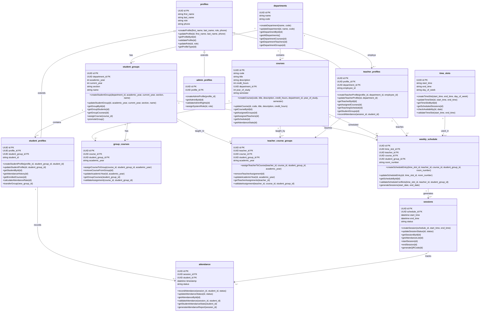

```mermaid
classDiagram
    class departments {
        UUID id PK
        string name
        string code
        +createDepartment(name, code)
        +updateDepartment(id, name, code)
        +getDepartmentById(id)
        +getAllDepartments()
        +getDepartmentCourses(id)
        +getDepartmentTeachers(id)
        +getDepartmentGroups(id)
    }
    
    class profiles {
        UUID id PK
        string first_name
        string last_name
        string role
        string phone
        +createProfile(first_name, last_name, role, phone)
        +updateProfile(id, first_name, last_name, phone)
        +getProfileById(id)
        +validateProfile(id)
        +updateRole(id, role)
        +getProfileType(id)
    }
    
    class student_groups {
        UUID id PK
        UUID department_id FK
        int academic_year
        int current_year
        string section
        string name
        +createStudentGroup(department_id, academic_year, current_year, section, name)
        +updateStudentGroup(id, academic_year, current_year, section, name)
        +getGroupById(id)
        +getGroupStudents(id)
        +getGroupCourses(id)
        +assignCourse(course_id)
        +promoteGroup()
    }
    
    class courses {
        UUID id PK
        string code
        string title
        string description
        int credit_hours
        UUID department_id FK
        int year_of_study
        string semester
        +createCourse(code, title, description, credit_hours, department_id, year_of_study, semester)
        +updateCourse(id, code, title, description, credit_hours)
        +getCourseById(id)
        +getAssignedGroups(id)
        +getAssignedTeachers(id)
        +getSchedule(id)
        +getAttendanceStats(id)
    }
    
    class admin_profiles {
        UUID id PK
        UUID profile_id FK
        +createAdminProfile(profile_id)
        +getAdminById(id)
        +validateAdminRights(id)
        +assignSystemRole(id, role)
    }
    
    class student_profiles {
        UUID id PK
        UUID profile_id FK
        UUID student_group_id FK
        string student_id
        +createStudentProfile(profile_id, student_group_id, student_id)
        +updateStudentProfile(id, student_group_id)
        +getStudentById(id)
        +getAttendanceHistory(id)
        +getEnrolledCourses(id)
        +calculateAttendanceRate(id)
        +transferGroup(new_group_id)
    }
    
    class teacher_profiles {
        UUID id PK
        UUID profile_id FK
        UUID department_id FK
        string employee_id
        +createTeacherProfile(profile_id, department_id, employee_id)
        +updateTeacherProfile(id, department_id)
        +getTeacherById(id)
        +getAssignedCourses(id)
        +getTeachingSchedule(id)
        +getStudentGroups(id)
        +recordAttendance(session_id, student_id)
    }
    
    class group_courses {
        UUID id PK
        UUID course_id FK
        UUID student_group_id FK
        string academic_year
        +assignCourseToGroup(course_id, student_group_id, academic_year)
        +removeCourseFromGroup(id)
        +updateAcademicYear(id, academic_year)
        +getGroupCourses(student_group_id)
        +validateAssignment(course_id, student_group_id)
    }
    
    class teacher_course_groups {
        UUID id PK
        UUID teacher_id FK
        UUID course_id FK
        UUID student_group_id FK
        string academic_year
        +assignTeacherToCourse(teacher_id, course_id, student_group_id, academic_year)
        +removeTeacherAssignment(id)
        +updateAcademicYear(id, academic_year)
        +getTeacherAssignments(teacher_id)
        +validateAssignment(teacher_id, course_id, student_group_id)
    }
    
    class time_slots {
        UUID id PK
        string start_time
        string end_time
        string day_of_week
        +createTimeSlot(start_time, end_time, day_of_week)
        +updateTimeSlot(id, start_time, end_time)
        +getTimeSlotById(id)
        +getScheduledSessions(id)
        +checkAvailability(id, date)
        +validateTimeSlot(start_time, end_time)
    }
    
    class weekly_schedule {
        UUID id PK
        UUID time_slot_id FK
        UUID teacher_id FK
        UUID course_id FK
        UUID student_group_id FK
        string room_number
        +createScheduleEntry(time_slot_id, teacher_id, course_id, student_group_id, room_number)
        +updateScheduleEntry(id, time_slot_id, room_number)
        +getScheduleById(id)
        +validateScheduleConflicts(time_slot_id, teacher_id, student_group_id)
        +generateSessions(start_date, end_date)
    }
    
    class sessions {
        UUID id PK
        UUID schedule_id FK
        datetime start_time
        datetime end_time
        string status
        +createSession(schedule_id, start_time, end_time)
        +updateSessionStatus(id, status)
        +getSessionById(id)
        +getAttendanceList(id)
        +startSession(id)
        +endSession(id)
        +generateQRCode(id)
    }
    
    class attendance {
        UUID id PK
        UUID session_id FK
        UUID student_id FK
        datetime timestamp
        string status
        +recordAttendance(session_id, student_id, status)
        +updateAttendanceStatus(id, status)
        +getAttendanceById(id)
        +validateAttendance(session_id, student_id)
        +getStudentAttendanceStats(student_id)
        +generateAttendanceReport(session_id)
    }
    
    departments "1" --> "0..*" courses : contains
    departments "1" --> "0..*" teacher_profiles : employs
    departments "1" --> "0..*" student_groups : has
    
    profiles <|-- admin_profiles : extends
    profiles <|-- student_profiles : extends
    profiles <|-- teacher_profiles : extends
    
    student_groups "1" --> "0..*" student_profiles : contains
    student_groups "1" --> "0..*" group_courses : has
    
    courses "1" --> "0..*" group_courses : assigned_to
    
    teacher_profiles "1" --> "0..*" teacher_course_groups : teaches
    courses "1" --> "0..*" teacher_course_groups : taught_by
    student_groups "1" --> "0..*" teacher_course_groups : taught_to
    
    time_slots "1" --> "0..*" weekly_schedule : used_in
    teacher_profiles "1" --> "0..*" weekly_schedule : teaches
    courses "1" --> "0..*" weekly_schedule : scheduled
    student_groups "1" --> "0..*" weekly_schedule : attends
    
    weekly_schedule "1" --> "0..*" sessions : generates
    sessions "1" --> "0..*" attendance : tracks
    student_profiles "1" --> "0..*" attendance : records
```