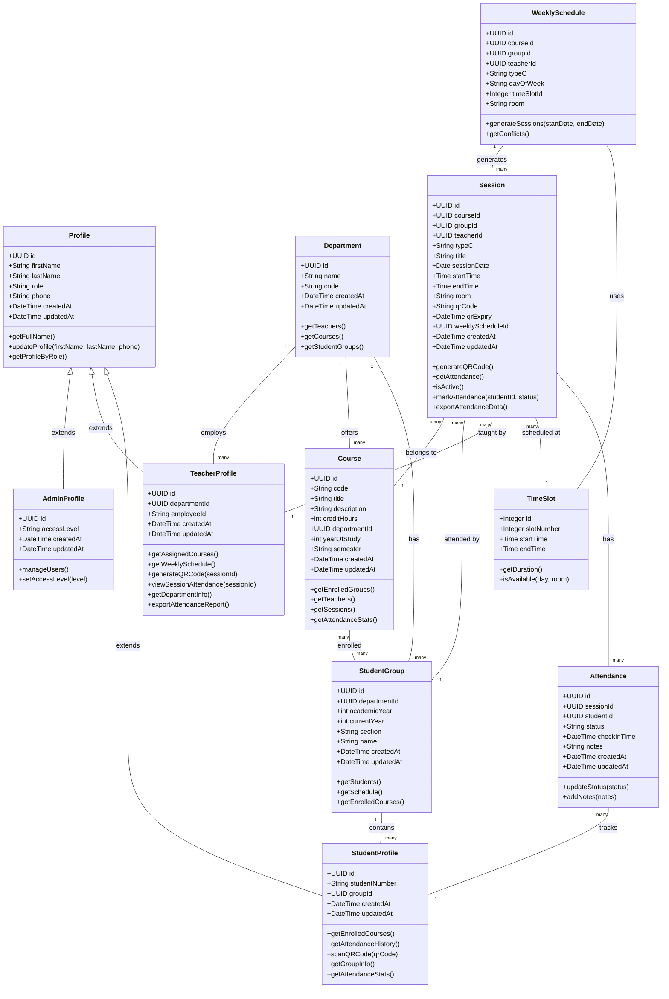
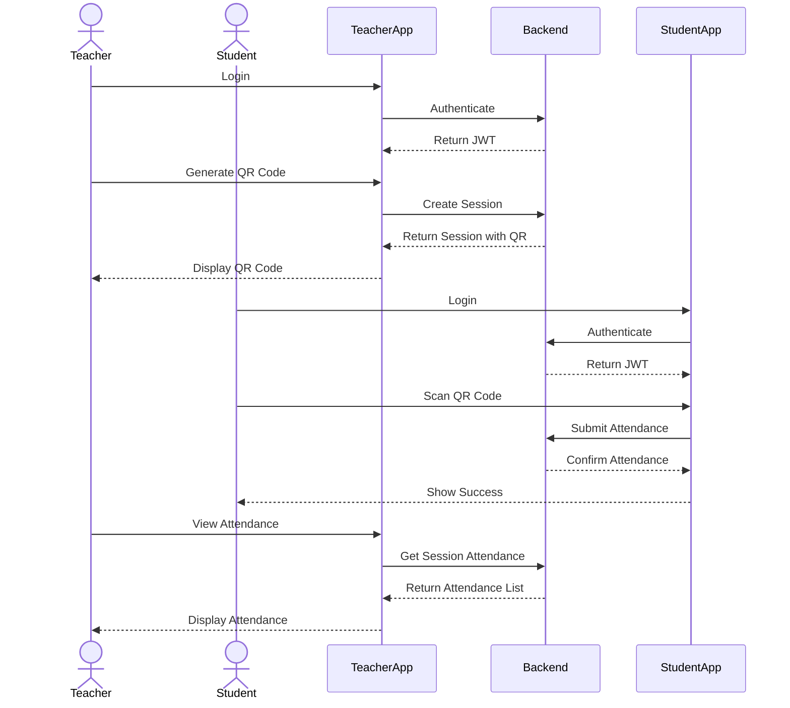
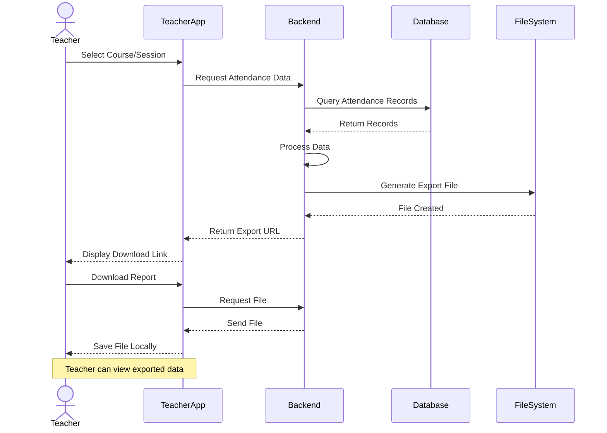
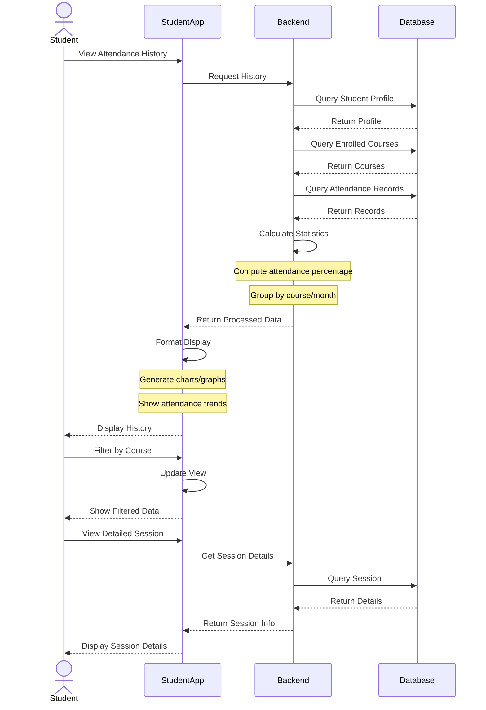

# Database UML Diagrams

## Class Diagram (Database Entities)

## Sequence Diagram (QR Code Attendance Flow)

## Sequence Diagram (Teacher Export Attendance Flow)

## Sequence Diagram (Student Attendance History View)

