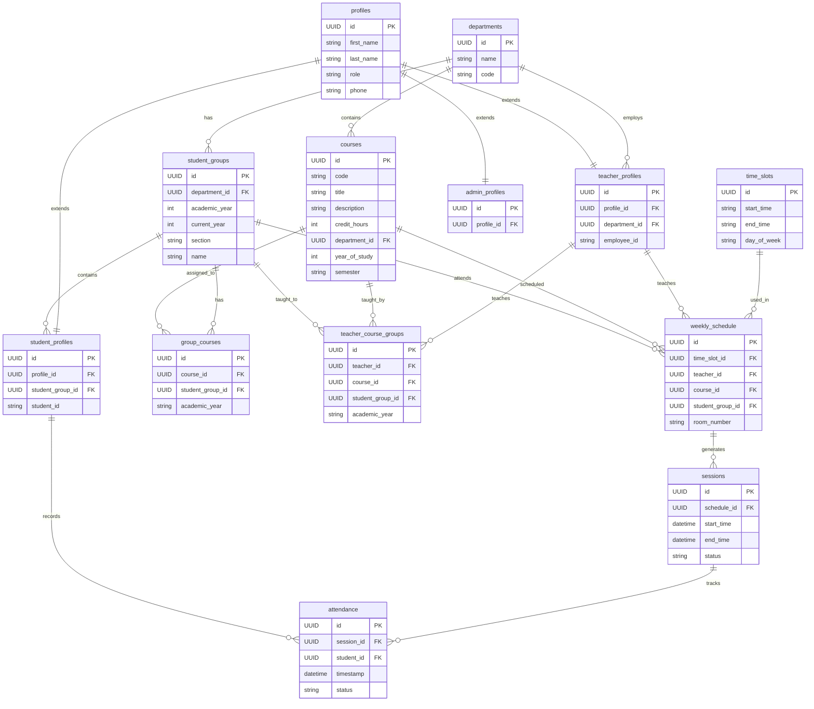
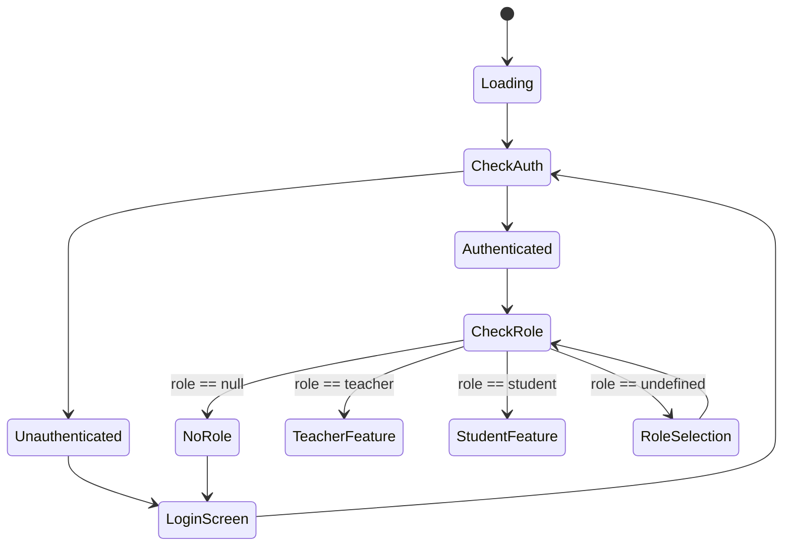
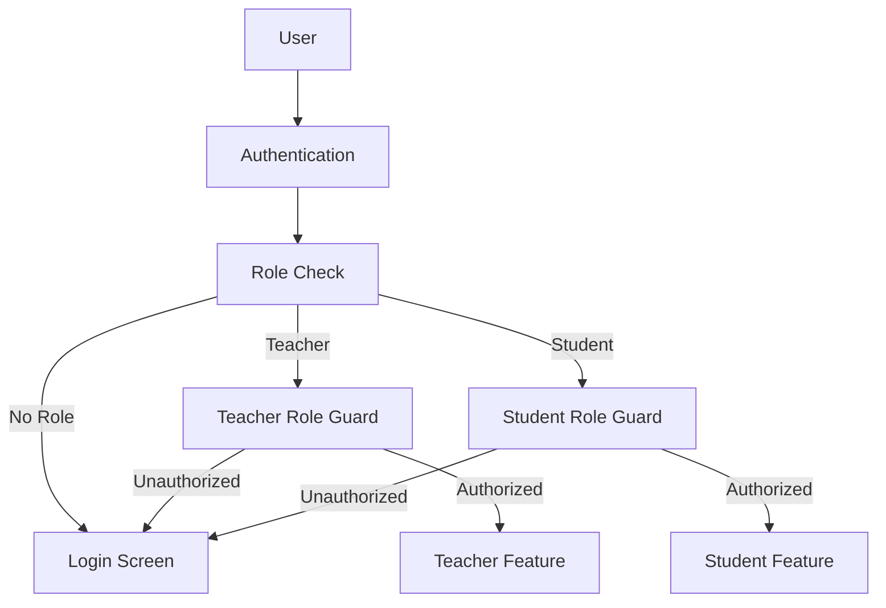
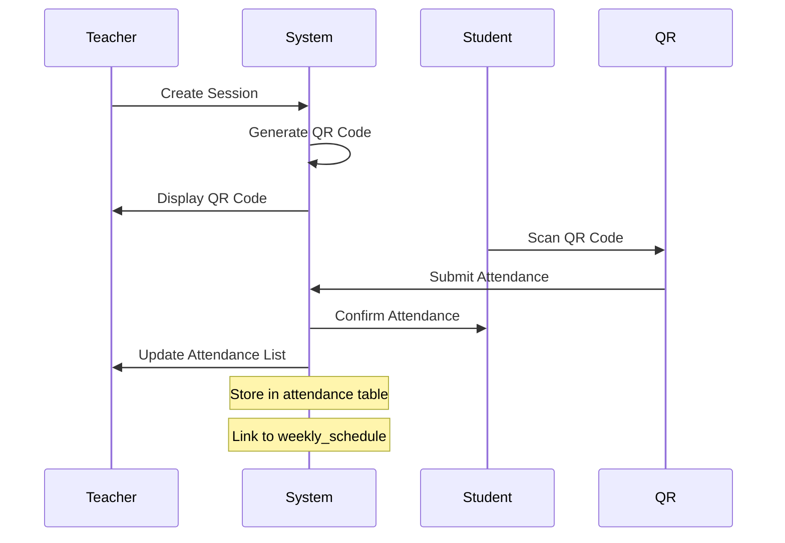
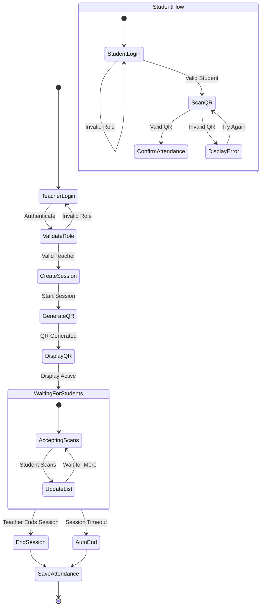

# System Diagrams

## Database Schema Diagram

## Authentication Flow Diagram

## Role-based Access Control Diagram

## Department and Course Structure

```mermaid
graph TB
    subgraph Departments
        CSE[Computer Science & Engineering]
        EE[Electrical Engineering]
        ME[Mechanical Engineering]
        CE[Civil Engineering]
        MP[Mathematics & Physics]
    end
    
    CSE --> CSE1[CSE101: Intro to Programming]
    CSE --> CSE2[CSE102: Data Structures]
    CSE --> CSE3[CSE201: Database Systems]
    CSE --> CSE4[CSE301: Software Engineering]
    
    EE --> EE1[EE101: Circuit Analysis]
    EE --> EE2[EE102: Digital Electronics]
    EE --> EE3[EE201: Signals and Systems]
    
    ME --> ME1[ME101: Engineering Mechanics]
    ME --> ME2[ME102: Thermodynamics]
    ME --> ME3[ME201: Fluid Mechanics]
    
    CE --> CE1[CE101: Structural Analysis]
    CE --> CE2[CE102: Construction Materials]
    CE --> CE3[CE201: Soil Mechanics]
    
    MP --> MP1[MP101: Calculus I]
    MP --> MP2[MP102: Physics Mechanics]
    MP --> MP3[MP201: Linear Algebra]
```

## Session Management Flow

## QR Code Attendance Activity Flow

## Flutter App Feature Structure

```mermaid
graph TB
    subgraph lib[lib directory]
        core[core/]
        features[features/]
        screens[screens/]
        mainDart[main.dart]
    end

    subgraph features_detail[Features Directory Structure]
        features --> auth[auth/]
        features --> theme[theme/]
        features --> teacher[teacher/]
        features --> student[student/]

        auth --> auth_screens[screens/]
        auth --> auth_providers[providers/]
        auth --> auth_widgets[widgets/]
        auth_screens --> login[login_screen.dart]
        auth_providers --> authProvider[auth_provider.dart]
        auth_widgets --> roleGuard[role_guard.dart]

        theme --> theme_providers[providers/]
        theme_providers --> themeProvider[theme_provider.dart]

        teacher --> teacher_screens[screens/]
        teacher --> teacher_providers[providers/]
        teacher --> teacher_widgets[widgets/]
        teacher --> teacherFeature[teacher_feature.dart]

        student --> student_screens[screens/]
        student --> student_providers[providers/]
        student --> student_widgets[widgets/]
        student --> studentFeature[student_feature.dart]
    end

    screens --> roleSelection[role_selection_screen.dart]

    classDef default fill:#f9f9f9,stroke:#333,stroke-width:2px;
    classDef feature fill:#e1f5fe,stroke:#0288d1,stroke-width:2px;
    classDef provider fill:#f3e5f5,stroke:#7b1fa2,stroke-width:2px;
    classDef screen fill:#e8f5e9,stroke:#388e3c,stroke-width:2px;
    
    class auth,theme,teacher,student feature;
    class auth_providers,theme_providers,teacher_providers,student_providers provider;
    class login,roleSelection,auth_screens,teacher_screens,student_screens screen;
```

Note: The diagram above shows the feature-based architecture of the Flutter app, with separate modules for authentication, theming, teacher features, and student features. Each feature module follows a similar structure with screens, providers, and widgets directories.