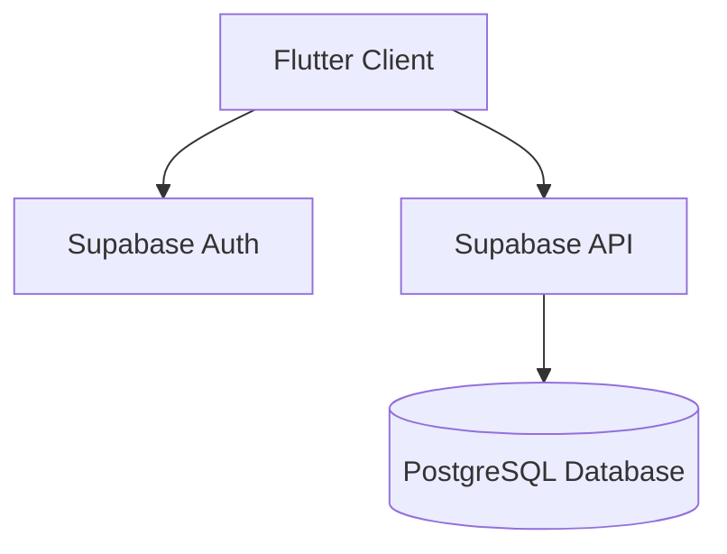

# QR Code Attendance System Documentation

## 1. Introduction

### 1.1 Project Overview
This system provides a modern solution for tracking student attendance using QR codes, with separate interfaces for teachers and students.

### 1.2 Objectives
- Streamline attendance tracking process
- Reduce manual entry errors
- Provide real-time attendance statistics
- Enable efficient attendance management

## 2. Technical Specifications

### 2.1 Hardware Requirements
- Mobile device with camera (for QR scanning)
- Server requirements: [To be specified]
- Minimum device specifications: [To be specified]

### 2.2 Software Stack
- Frontend: Flutter
- Backend: Supabase
- Database: PostgreSQL
- Authentication: Supabase Auth

### 2.3 Development Tools
- IDE: Visual Studio Code
- Version Control: Git
- State Management: Riverpod
- Dependencies: [List key packages]

## 3. Application Architecture

### 3.1 System Architecture

### 3.2 Database Schema
[Database schema diagram to be added]

### 3.3 Authentication Flow
[Authentication flow diagram to be added]

## 4. Interface Documentation

### 4.1 Teacher Interface

#### 4.1.1 Login Screen
[Image Placeholder: teacher_login.png]
Description of the teacher login interface and authentication process.

#### 4.1.2 Dashboard
[Image Placeholder: teacher_dashboard.png]
Overview of the teacher's main dashboard and its features.

#### 4.1.3 QR Generation
[Image Placeholder: qr_generation.png]
Documentation of the QR code generation process for classes.

#### 4.1.4 Attendance Management
[Image Placeholder: attendance_management.png]
Details of attendance tracking and management features.

### 4.2 Student Interface

#### 4.2.1 Login Screen
[Image Placeholder: student_login.png]
Description of the student login interface.

#### 4.2.2 QR Scanner
[Image Placeholder: qr_scanner.png]
Documentation of the QR code scanning functionality.

#### 4.2.3 Attendance History
[Image Placeholder: attendance_history.png]
Overview of student attendance history view.

## 5. Implementation Details

### 5.1 Core Features
- User authentication and authorization
- QR code generation and scanning
- Real-time attendance tracking
- Attendance report generation
- Profile management

### 5.2 Implementation Challenges
- Handling offline scenarios
- QR code security measures
- Real-time synchronization
- Data consistency

### 5.3 Future Improvements
- Batch attendance processing
- Advanced analytics
- Integration with academic management systems
- Enhanced reporting features

## Image Placeholders Guide

For adding interface screenshots later:

1. Teacher Interface Images:
   - Resolution: 1920x1080 recommended
   - Format: PNG
   - Location: `/doc/images/teacher/`

2. Student Interface Images:
   - Resolution: 1920x1080 recommended
   - Format: PNG
   - Location: `/doc/images/student/`

3. Diagrams:
   - Format: PNG/SVG
   - Location: `/doc/images/diagrams/`