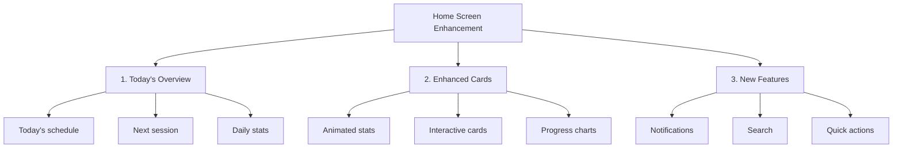
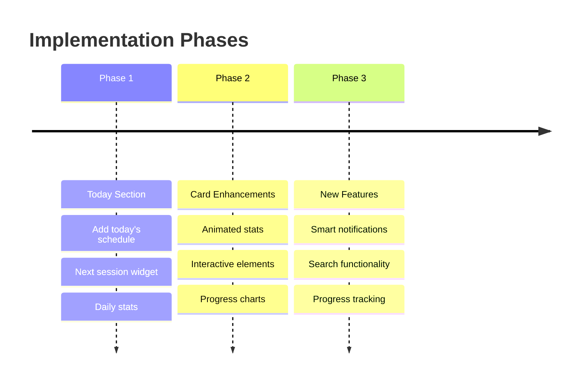

# Student Home Screen Enhancement Plan

## Overview
This plan outlines improvements to enhance the student home screen with more features and better interactivity.

## 1. Today's Overview Section
- Add "Today's Schedule" preview card:
  * Show next 3 upcoming sessions
  * Quick attendance marking
  * Direct schedule navigation
- Next Session Widget:
  * Countdown timer
  * Room information
  * Quick QR scanner access
- Daily Statistics:
  * Today's attendance status
  * Classes remaining
  * Week progress

## 2. Enhanced Existing Cards
### Action Cards:
- Add hover animations
- Show recent activity badges
- Include status indicators
- Quick access popups

### Attendance Overview:
- Animated statistics counters
- Interactive donut chart
- Monthly comparison
- Attendance trends graph
- Subject-wise breakdown

### Quick Tips:
- Make tips actionable
- Add progress indicators
- Include achievement system
- Daily challenges

## 3. New Features
### Smart Notifications:
- Upcoming session reminders
- Missing attendance alerts
- Achievement notifications
- Important deadlines

### Search & Quick Actions:
- Global search bar
- Voice commands
- Quick filters
- Favorites system

### Student Progress:
- Monthly attendance goals
- Achievement badges
- Progress indicators
- Comparison with class average

## Implementation Timeline

## Technical Considerations
1. Performance optimization for animations
2. State management for real-time updates
3. Caching for offline access
4. Responsive layout support