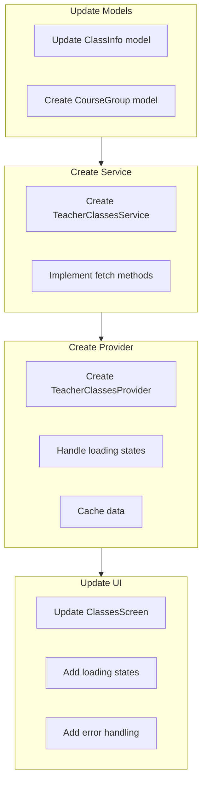

# Classes Page Database Integration Plan

## Overview
Update the classes page to fetch real data from the database, showing courses and groups for the current academic period. This will replace the current hardcoded data implementation.

## Implementation Steps



### 1. Update Models

#### ClassInfo Model Updates
```dart
class ClassInfo {
  final String id;
  final String code;
  final String title;
  final String description;
  final int creditHours;
  final int yearOfStudy;
  final String semester;
  final List<CourseGroup> groups;

  const ClassInfo({
    required this.id,
    required this.code,
    required this.title,
    required this.description,
    required this.creditHours,
    required this.yearOfStudy,
    required this.semester,
    required this.groups,
  });

  factory ClassInfo.fromJson(Map<String, dynamic> json);
  Map<String, dynamic> toJson();
}
```

#### New CourseGroup Model
```dart
class CourseGroup {
  final String id;
  final String name;
  final int academicYear;
  final int currentYear;
  final String section;
  final int studentCount;

  const CourseGroup({
    required this.id,
    required this.name,
    required this.academicYear,
    required this.currentYear,
    required this.section,
    required this.studentCount,
  });

  factory CourseGroup.fromJson(Map<String, dynamic> json);
  Map<String, dynamic> toJson();
}
```

### 2. Create TeacherClassesService

Create a new service class to handle database operations:

```dart
class TeacherClassesService {
  final SupabaseClient _supabaseClient;

  TeacherClassesService(this._supabaseClient);

  Future<List<ClassInfo>> getTeacherCourses(String teacherId, String academicPeriod) async {
    // Query teacher_course_groups, courses, and student_groups tables
  }

  Future<List<CourseGroup>> getCourseGroups(String courseId, String academicPeriod) async {
    // Query student_groups table
  }
}
```

### 3. Create TeacherClassesProvider

```dart
final teacherClassesProvider = StateNotifierProvider<TeacherClassesNotifier, AsyncValue<List<ClassInfo>>>((ref) {
  final supabase = ref.watch(supabaseClientProvider);
  final service = TeacherClassesService(supabase);
  return TeacherClassesNotifier(service);
});

class TeacherClassesNotifier extends StateNotifier<AsyncValue<List<ClassInfo>>> {
  final TeacherClassesService _service;

  TeacherClassesNotifier(this._service) : super(const AsyncValue.loading()) {
    loadClasses();
  }

  Future<void> loadClasses() async {
    // Load classes and handle errors
  }

  Future<void> refresh() async {
    // Refresh data
  }
}
```

### 4. Update UI

#### ClassesScreen Updates
- Replace hardcoded data with provider
- Add loading states
- Add error handling
- Update UI to display new course information
- Add semester/academic period filter

## Database Queries

### Get Teacher Courses
```sql
SELECT c.*, count(sg.id) as student_count
FROM teacher_course_groups tcg
JOIN courses c ON tcg.course_id = c.id
JOIN student_groups sg ON tcg.group_id = sg.id
WHERE tcg.teacher_id = :teacher_id
AND tcg.academic_period = :academic_period
GROUP BY c.id;
```

### Get Course Groups
```sql
SELECT sg.*
FROM student_groups sg
JOIN teacher_course_groups tcg ON sg.id = tcg.group_id
WHERE tcg.course_id = :course_id
AND tcg.academic_period = :academic_period;
```

## Testing Plan

1. Unit Tests
   - Test model serialization
   - Test service methods
   - Test provider state management

2. Widget Tests
   - Test loading states
   - Test error states
   - Test data display
   - Test filtering

3. Integration Tests
   - Test full data flow
   - Test navigation
   - Test refresh functionality