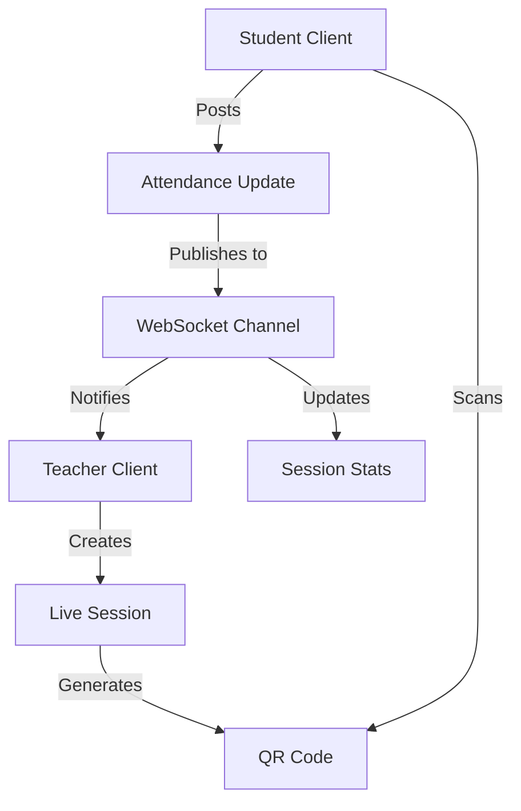
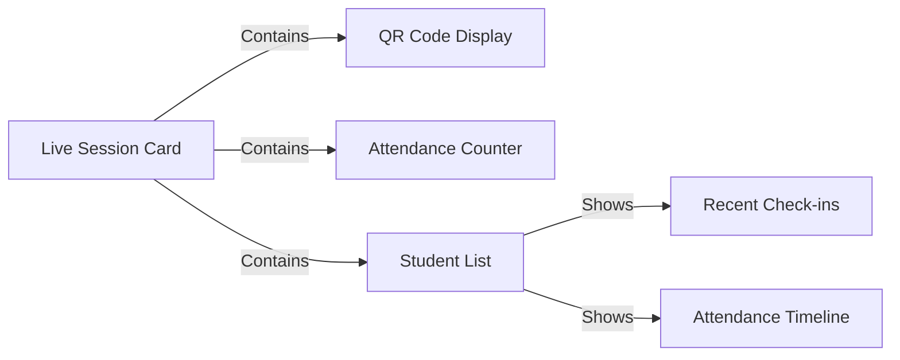
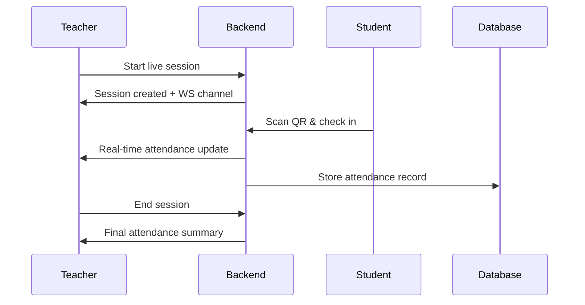

# Live Attendance Tracking System Design

## Overview

This document outlines the technical design for adding real-time attendance tracking functionality when teachers share QR codes for their sessions.

## 1. Data Model Changes

### New Models

```typescript
interface LiveSession {
  id: string;
  courseId: string;
  sessionType: string;
  groupId: string;
  startTime: DateTime;
  endTime?: DateTime;
  status: 'active' | 'completed';
  qrCodeData: string;
}

interface LiveAttendanceUpdate {
  sessionId: string;
  studentId: string;
  timestamp: DateTime;
  status: 'present';
  checkInLocation?: GeoLocation;
}

interface LiveSessionStats {
  totalStudents: number;
  presentStudents: number;
  recentCheckins: LiveAttendanceUpdate[];
}
```

## 2. Backend Architecture



### WebSocket Implementation
- Create dedicated WebSocket channels for each active session
- Channel format: `attendance_updates_{session_id}`
- Real-time updates for:
  - New student check-ins
  - Session statistics
  - Session status changes

### API Endpoints

```plaintext
POST /api/v1/sessions/live
  - Create new live session
  - Generate unique session ID
  - Return WebSocket channel info

POST /api/v1/sessions/{id}/attendance
  - Record student attendance
  - Broadcast update to WebSocket

GET /api/v1/sessions/{id}/stats
  - Get current session statistics
  - Used for initial load and recovery
```

## 3. Frontend Components

### Teacher Dashboard Updates



### New Components
1. LiveSessionManager
   - Manages WebSocket connection
   - Handles real-time updates
   - Maintains session state

2. LiveAttendanceDisplay
   - Visual representation of attendance data
   - Auto-updating stats and charts
   - Student check-in animations

3. SessionControls
   - Start/End session
   - Toggle QR code visibility
   - Export attendance data

## 4. Real-time Sync Strategy

### WebSocket Message Types

```typescript
interface WebSocketMessage {
  type: 'CHECK_IN' | 'STATS_UPDATE' | 'SESSION_STATUS';
  payload: {
    sessionId: string;
    timestamp: DateTime;
    data: any;
  };
}
```

### State Management
1. Use Riverpod for reactive state updates
2. Implement optimistic updates for better UX
3. Handle offline/reconnection scenarios

### Data Flow


## 5. Implementation Phases

### Phase 1: Core Infrastructure
- [ ] Database schema updates
- [ ] WebSocket server setup
- [ ] Basic real-time communication

### Phase 2: Teacher Features
- [ ] Live session management
- [ ] Real-time attendance display
- [ ] Basic statistics

### Phase 3: Enhanced Features
- [ ] Advanced analytics
- [ ] Export capabilities
- [ ] Attendance trends
- [ ] Location validation

## 6. Security Considerations

1. WebSocket Authentication
   - JWT token validation
   - Session-specific access control
   - Rate limiting for connections

2. QR Code Security
   - Time-based validation
   - Single-use tokens
   - Geofencing options

## 7. Performance Considerations

1. Scaling Strategy
   - Separate WebSocket servers
   - Redis for pub/sub
   - Horizontal scaling

2. Optimizations
   - Batch updates
   - Efficient state diff
   - Connection pooling

## 8. Testing Strategy

1. Unit Tests
   - WebSocket message handling
   - State management
   - Data transformations

2. Integration Tests
   - Real-time sync
   - Offline behavior
   - Multi-client scenarios

3. Load Tests
   - Concurrent connections
   - Message throughput
   - Recovery scenarios