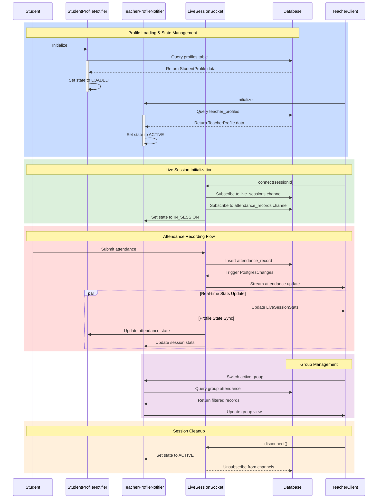

# Profile States and Transitions Sequence Diagram

This diagram illustrates the complete flow of profile states and transitions during the attendance process, including real-time updates and database interactions.

## State Transitions

### Student Profile States
- INITIALIZING → LOADED → IN_SESSION
- IN_SESSION → ATTENDANCE_RECORDED
- ATTENDANCE_RECORDED → LOADED

### Teacher Profile States
- INITIALIZING → ACTIVE → IN_SESSION
- IN_SESSION → MONITORING
- MONITORING → ACTIVE

### Live Session States
- CONNECTING → SUBSCRIBED
- SUBSCRIBED → ACTIVE
- ACTIVE → DISCONNECTED

## Database Tables
1. profiles
   - Base profile information
   - Shared between students and teachers

2. teacher_profiles
   - Teacher-specific profile data
   - Department and employee information

3. live_sessions
   - Active attendance sessions
   - Real-time session statistics

4. attendance_records
   - Attendance submissions
   - Timestamp and session data

## Real-time Components
- LiveSessionSocketService manages WebSocket connections
- PostgresChanges subscriptions for live updates
- Broadcast channels for attendance updates
- Stream controllers for UI synchronization
