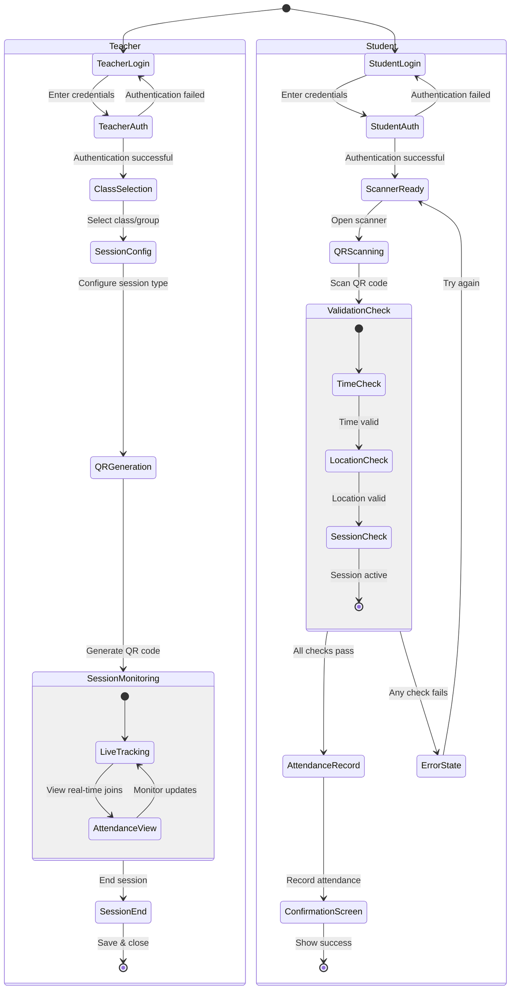

# QR Code Attendance System Flow

## Flow Description

### Teacher Flow
1. **Authentication**
   - Teacher logs in with credentials
   - System validates authentication
   - Failed login returns to login screen

2. **Session Setup**
   - Select class/group for attendance
   - Configure session parameters (type, duration, etc.)
   - Generate QR code for students

3. **Session Monitoring**
   - Track real-time student attendance
   - View who has joined the session
   - Monitor ongoing attendance updates

4. **Session Closure**
   - End session when complete
   - Save attendance records
   - Close session monitoring

### Student Flow
1. **Authentication**
   - Student logs in with credentials
   - System validates authentication
   - Failed login returns to login screen

2. **QR Code Scanning**
   - Access scanner interface
   - Scan teacher-generated QR code

3. **Validation Process**
   - Check if scan time is within session window
   - Verify student's location (if applicable)
   - Confirm session is still active

4. **Attendance Recording**
   - Record verified attendance in system
   - Show confirmation to student
   - Handle any validation errors with retry option

This diagram illustrates the complete flow of the QR code attendance system, showing the parallel processes for both teachers and students, including authentication, core functionality, and success/error handling paths.