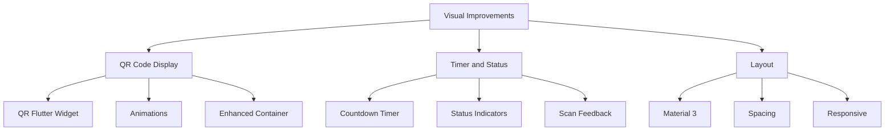
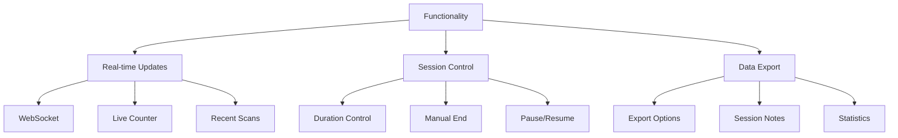
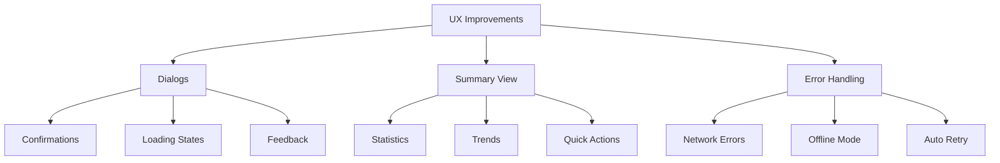

# QR Code Screen Enhancement Plan

## Overview
This enhancement plan aims to improve the QR code generation screen with better visual design, expanded functionality, and improved user experience.

## Visual Improvements

### QR Code Display
- Replace placeholder icon with proper QR code widget using `qr_flutter` package
- Add fade-in/scale animation when QR code is generated
- Enhance QR code container with better shadows and borders

### Timer and Status
- Add circular countdown timer for session duration
- Implement session status indicators (Active/Ending Soon/Expired)
- Add visual feedback for successful scans

### Layout Enhancements
- Implement Material 3 design principles
- Improve spacing and hierarchy
- Add responsive layout support for different screen sizes

## Functionality Improvements

### Real-time Attendance
- Implement WebSocket connection for live updates
- Show real-time student count
- Display recent scans with animations

### Session Management
- Add session duration selector (15/30/45/60 minutes)
- Enable manual session end capability
- Implement session pause/resume functionality

### Data Management
- Add CSV/PDF export for attendance data
- Enable session notes/comments
- Implement attendance statistics

## UX Improvements

### Dialogs and Feedback
- Add confirmation dialogs for important actions
- Implement loading indicators for async operations
- Show error snackbars with retry options

### Session Summary
- Create detailed session summary view
- Show attendance statistics and trends
- Enable quick actions (export, share, etc.)

### Error Handling
- Improve network error handling
- Add offline support
- Implement automatic retry logic

## Implementation Phases

### Phase 1: Core Visual Improvements
1. Integrate QR Flutter package
2. Implement basic animations
3. Enhance layout and styling

### Phase 2: Essential Functionality
1. Set up WebSocket connections
2. Add session duration control
3. Implement basic export features

### Phase 3: UX Enhancement
1. Add confirmation dialogs
2. Implement loading states
3. Create session summary view

### Phase 4: Advanced Features
1. Add offline support
2. Implement statistics
3. Enable advanced export options