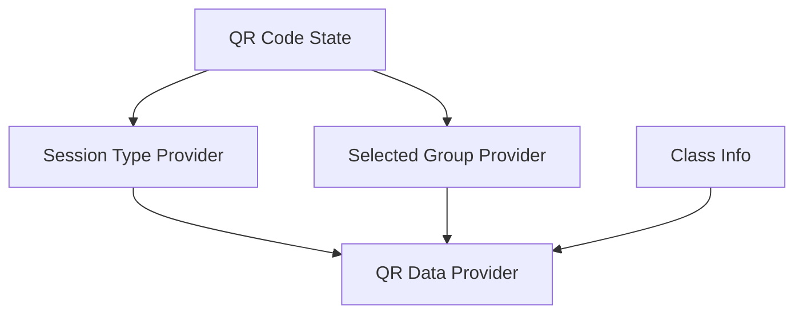
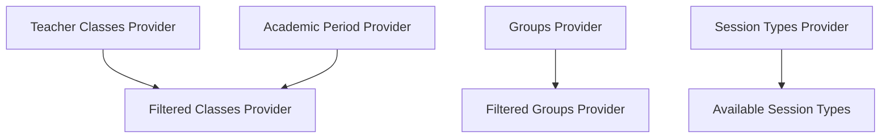

# Riverpod Optimization Plan for Teacher Feature

## Current Analysis

The teacher feature currently has:
1. Some Riverpod integration in ClassesScreen
2. StatefulWidget-based QR code generator
3. Basic provider structure for teacher classes

## Optimization Plan

### 1. QR Code Generation State Management



#### New Providers to Create:

```dart
// In lib/features/teacher/providers/qr_code_providers.dart
final qrSessionTypeProvider = StateProvider<String?>((ref) => null);
final qrSelectedGroupProvider = StateProvider<String?>((ref) => null);
final sessionTypesProvider = Provider<List<String>>((ref) => ['Course', 'TD', 'TP']);

final qrDataProvider = Provider.family<String, ClassInfo>((ref, classInfo) {
  final sessionType = ref.watch(qrSessionTypeProvider);
  final selectedGroup = ref.watch(qrSelectedGroupProvider);
  
  if (sessionType == null || selectedGroup == null) {
    return '';
  }
  
  return jsonEncode({
    "course_id": classInfo.id,
    "course_code": classInfo.code,
    "session_type": sessionType,
    "group_id": selectedGroup,
    "timestamp": DateTime.now().toIso8601String()
  });
});
```

### 2. Teacher Classes Provider Enhancement



#### Enhanced Provider Structure:

```dart
// In lib/features/teacher/providers/teacher_providers.dart

// Enhanced groups provider
final groupsProvider = Provider.family<List<Group>, String>((ref, courseId) {
  final classesData = ref.watch(teacherClassesProvider);
  return classesData.whenData((classes) {
    final course = classes.firstWhere((c) => c.id == courseId);
    return course.groups;
  });
});

// Cached classes provider
final cachedTeacherClassesProvider = Provider<AsyncValue<List<TeacherClass>>>((ref) {
  final classes = ref.watch(teacherClassesProvider);
  
  ref.listenSelf((previous, next) {
    if (previous != next) {
      // Implement caching logic
    }
  });
  
  return classes;
});
```

### 3. Implementation Steps

1. **Create Provider Files**
   - Create qr_code_providers.dart
   - Update teacher_providers.dart
   - Add proper error handling utilities

2. **Convert QR Code Generator**
   - Change to ConsumerWidget
   - Implement provider-based state management
   - Add error boundaries
   - Implement proper cleanup

3. **Enhance Error Handling**
   - Create custom error types
   - Implement error recovery strategies
   - Add user-friendly error messages

4. **Add Caching Layer**
   - Implement local storage for frequently used data
   - Add cache invalidation strategy
   - Optimize network requests

### 4. Benefits

1. **Improved State Management**
   - Centralized state
   - Predictable updates
   - Easier testing

2. **Better Performance**
   - Reduced rebuilds
   - Efficient caching
   - Optimized updates

3. **Enhanced Error Handling**
   - Graceful error recovery
   - Better user experience
   - Consistent error messages

4. **Code Organization**
   - Clear separation of concerns
   - Better maintainability
   - Easier extensions

## Implementation Order

1. Create new provider files and structure
2. Convert QR generator to use Riverpod
3. Enhance existing providers
4. Add caching layer
5. Implement error handling
6. Add tests
7. Documentation

## Technical Considerations

1. **State Management**
   - Use StateProvider for simple state
   - Use AsyncNotifier for complex state
   - Implement proper state restoration

2. **Performance**
   - Minimize rebuilds
   - Implement proper caching
   - Optimize network requests

3. **Testing**
   - Add unit tests for providers
   - Add widget tests for new components
   - Test error scenarios

4. **Migration**
   - Gradual migration approach
   - Maintain backward compatibility
   - Add proper documentation