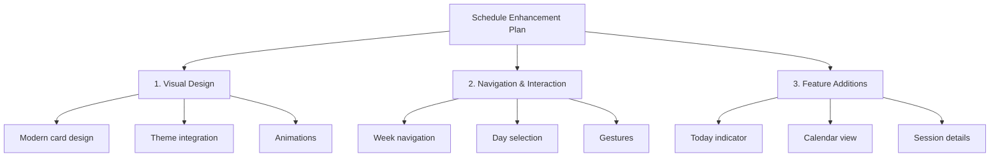
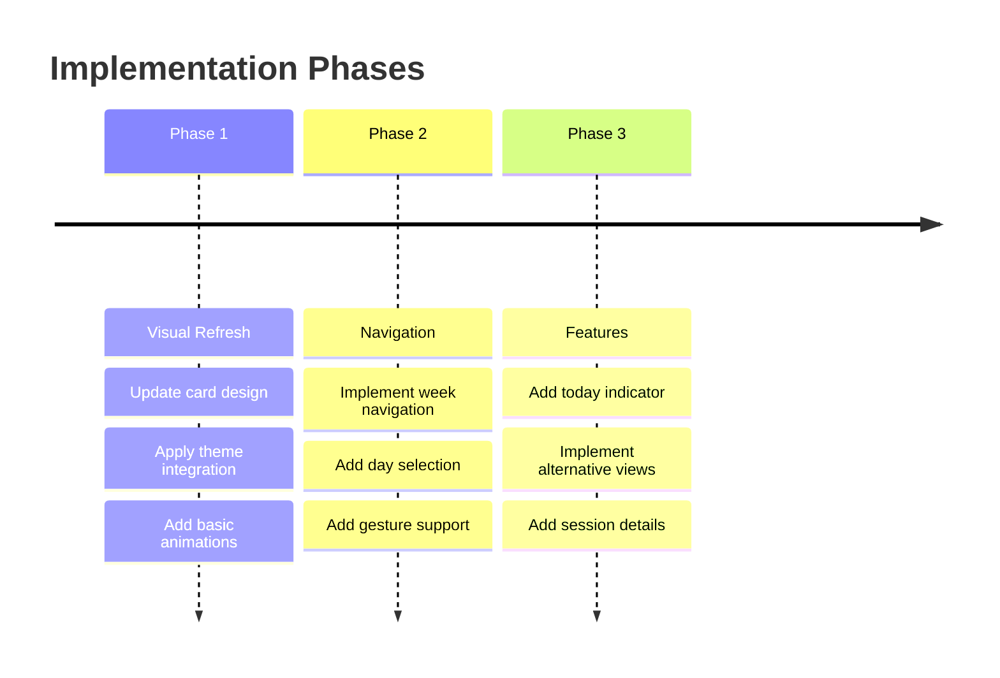

# Schedule Screen Enhancement Plan

## Overview
This plan outlines improvements to enhance the student schedule screen with modern design elements and better user experience.

## 1. Visual Design Improvements
- Apply modern card design for sessions:
  * Gradient backgrounds using session type colors
  * Elevated shadows with depth effect
  * Rounded corners and better spacing
  * Icons for session types
- Theme integration:
  * Use theme colors for better consistency
  * Dark mode support
  * Color-coded session types using theme palette
- Animations and transitions:
  * Smooth loading animations
  * Card hover effects
  * Session detail expansion animation

## 2. Navigation & Interaction Improvements
- Week Navigation:
  * Add week selector at the top
  * Previous/Next week buttons
  * Jump to specific week
- Day Selection:
  * Quick day jumper
  * Today button
  * Active day indicator
- Gesture Support:
  * Swipe between weeks
  * Tap to expand session details
  * Pull to refresh

## 3. New Features
### Today Indicator
- Highlight current day
- Show current time indicator
- Mark ongoing session

### Alternative Views
- Add calendar month view option
- List view for today's sessions
- Week view (current)

### Session Details
- Expandable session cards with:
  * Complete course information
  * Teacher contact
  * Room details with map
  * Attendance history
  * Quick attendance action

## Implementation Timeline

## Technical Considerations
1. Performance optimization for smooth scrolling
2. State management for view switches
3. Caching for offline access
4. Responsive layout support