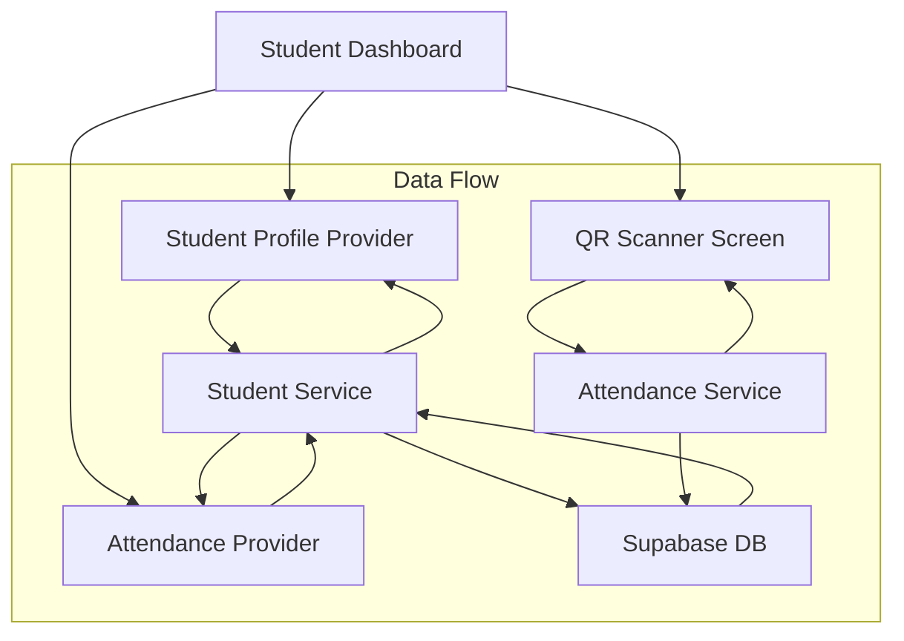
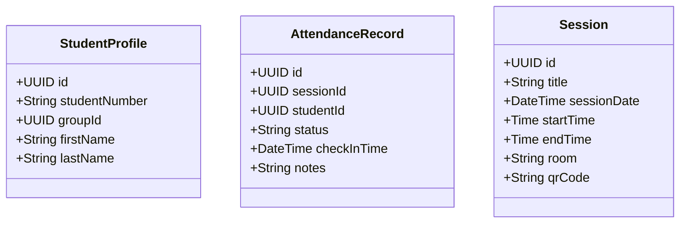

# Student Attendance Feature Implementation Plan

## Overview
This document outlines the implementation plan for the student attendance feature, which will allow students to view their attendance records and mark attendance by scanning QR codes.

## Architecture Overview



## Component Structure

### Data Models



## Implementation Steps

### 1. Student Profile Setup
- Create student profile provider and service
- Implement methods to fetch student details using current auth user
- Create student profile model class

### 2. Attendance Management
- Create attendance provider and service
- Implement methods to fetch student's attendance records
- Create attendance record model class

### 3. QR Code Scanner
- Implement QR code scanner screen
- Add camera permissions handling
- Create QR code validation and processing logic
- Implement attendance marking through API

### 4. UI Components
- Update student dashboard with:
  - Profile information section
  - Attendance history list/calendar view
  - Scan QR code button
- Create attendance details screen
- Add loading and error states

### 5. Database Integration
- Configure Supabase queries for:
  - Fetching student profile
  - Retrieving attendance records
  - Marking attendance via QR code
- Implement proper error handling

## Project Structure
```
lib/features/student/
├── models/
│   ├── student_profile.dart
│   └── attendance_record.dart
├── providers/
│   ├── student_profile_provider.dart
│   └── attendance_provider.dart
├── services/
│   ├── student_service.dart
│   └── attendance_service.dart
└── screens/
    ├── attendance_history_screen.dart
    ├── attendance_detail_screen.dart
    └── qr_scanner_screen.dart
```

## Dependencies
- `qr_code_scanner`: For QR code scanning functionality
- `table_calendar`: For attendance calendar view (optional)

## Database Integration Details

### Required Tables (Already Existing)
- profiles
- student_profiles
- sessions
- attendance

### Key Database Operations
1. Fetch Student Profile:
```sql
SELECT p.*, sp.*
FROM profiles p
JOIN student_profiles sp ON p.id = sp.id
WHERE p.id = :current_user_id
```

2. Fetch Student Attendance:
```sql
SELECT a.*, s.*
FROM attendance a
JOIN sessions s ON a.session_id = s.id
WHERE a.student_id = :student_id
```

3. Mark Attendance (via QR code):
```sql
INSERT INTO attendance (
    session_id,
    student_id,
    status,
    check_in_time
) VALUES (
    :session_id,
    :student_id,
    'present',
    CURRENT_TIMESTAMP
)
```

## Next Steps
1. Begin with the models and providers implementation
2. Set up the basic UI structure
3. Implement QR scanning functionality
4. Add attendance history viewing
5. Test and refine the feature