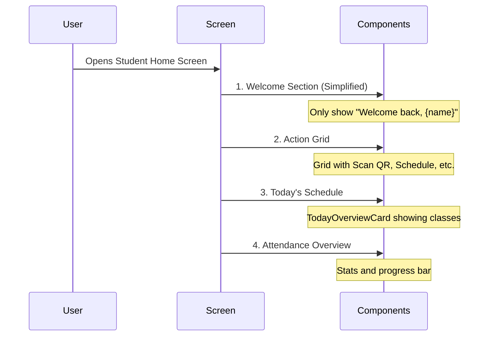

# Student Home Screen Layout Reorganization Plan

## Overview
Reorganize the student home screen layout to improve user experience and prioritize important information.

## Changes Required

### 1. Welcome Section Modification
- Remove student number display
- Keep only "Welcome back, {name}"
- Maintain existing styling for visual consistency

### 2. New Layout Order
1. Welcome Section (simplified)
2. Action Grid (Quick access buttons)
3. Today's Schedule
4. Attendance Overview



## Implementation Details

### File to Modify
- `lib/features/student/screens/student_home_screen.dart`

### Code Changes Required
1. Update Column children order in StudentHomeScreen's build method:
   ```dart
   Column(
     children: [
       _buildWelcomeSection(context, profile),
       const SizedBox(height: 24),
       _buildActionGrid(context, ref),
       const SizedBox(height: 24),
       const TodayOverviewCard(),
       const SizedBox(height: 24),
       _buildAttendanceCard(context, attendanceStats),
     ],
   )
   ```

2. Modify welcome section to remove student number:
   - Remove the Text widget displaying student number
   - Keep only the welcome message and name display

### Benefits
- Quick access to important actions through the grid at the top
- Cleaner welcome message focusing on personalization
- Logical information hierarchy from actions to schedule to attendance stats