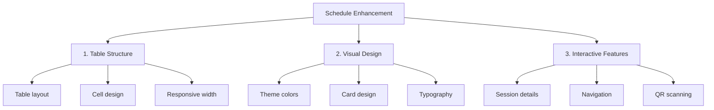
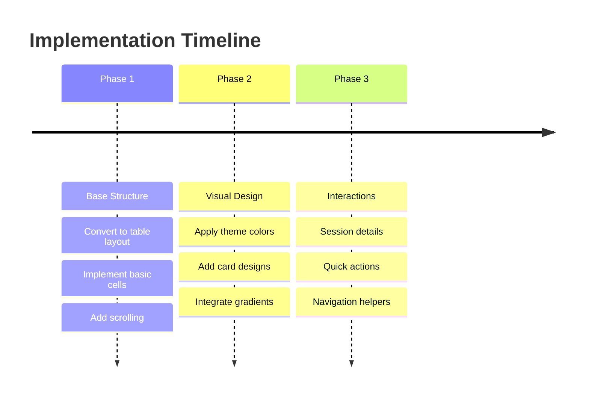

# Student Schedule Table Enhancement Plan

## Overview
This plan outlines the changes needed to adapt the teacher's table-based schedule layout for the student side, while maintaining our modern design system.

## 1. Table Structure Implementation
- Replace current grid with Table widget
- Create fixed time slots column
- Implement horizontally scrollable days columns
- Set minimum width constraints
- Add proper borders and spacing

## 2. Visual Design Integration
### Table Styling
- Use theme colors for borders
- Apply rounded corners
- Add subtle shadows
- Implement proper spacing

### Cell Design
- Modern card design for sessions
- Color coding by session type
- Gradient backgrounds
- Status indicators

### Header Design
- Sticky day headers
- Today indicator
- Time slot styling

## 3. Features & Interactions
### Session Cells
- Tap to show details dialog
- Course information display
- Room and teacher info
- Quick actions

### Navigation
- Horizontal scroll for days
- Refresh capability
- Quick jump to current day

## Implementation Phases

## Technical Considerations
1. Maintain existing data structure
2. Preserve theme integration
3. Keep session details dialog
4. Ensure responsive behavior

## Colors & Typography
- Use our brand colors:
  * Primary: #08A045
  * Secondary: #21D375
- Maintain consistent font sizes
- Clear visual hierarchy

Would you like to proceed with adapting the schedule screen to this table-based layout?