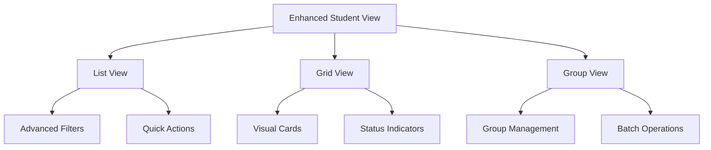
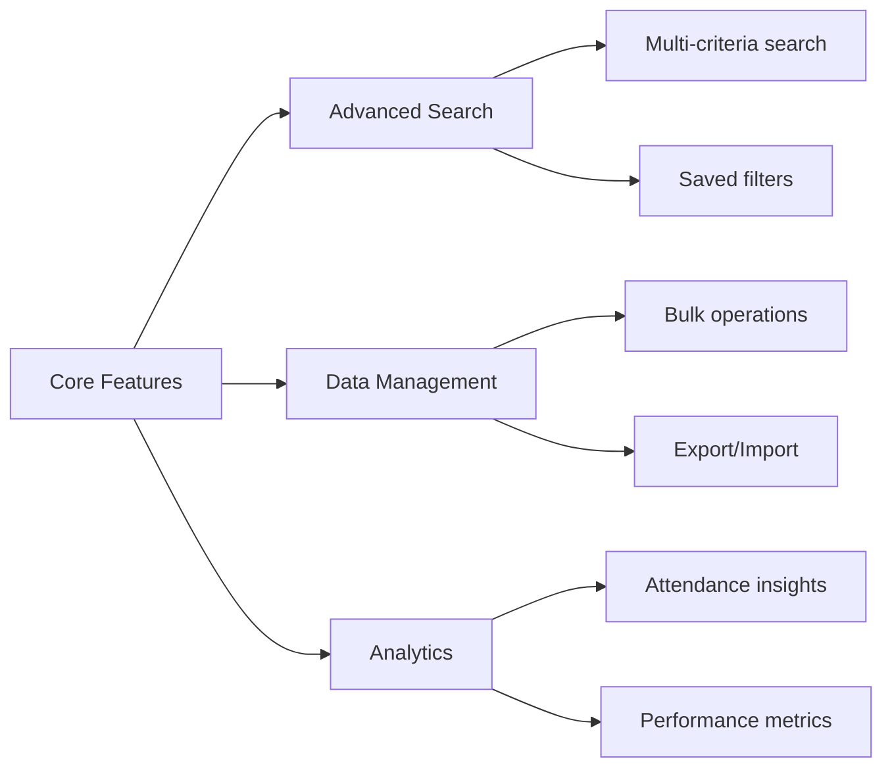

# Student View Enhancement Plan

## Current Implementation Analysis

### 1. Layout and UI Components

#### Course Student View (`CourseStudentView`)
- Simple list view of students with basic information
- Search functionality for filtering students
- Basic card-based UI with:
  - Student ID as avatar
  - Student ID as title
  - Group name as subtitle
  - Navigation chevron (non-functional)

#### Grouped Student View (`GroupedStudentView`)
- Expandable group-based view
- Shows student count per group
- Animated expansion/collapse
- Basic student list within groups
- Limited student information display

#### Students Screen (`StudentsScreen`)
- Simple list of all students
- Shows attendance rates with color coding
- Basic floating action button for adding students (non-functional)
- Limited filtering and sorting capabilities

### 2. Current Limitations

1. **Data Presentation**
   - Limited student information displayed
   - No sorting capabilities
   - Basic search functionality only on ID and group name
   - No data export capabilities
   - No batch operations support

2. **User Interaction**
   - Non-functional student selection
   - Limited group management features
   - No quick actions or bulk operations
   - Missing student details view
   - No attendance history visualization

3. **Organization**
   - No tabs or sections for different views
   - Limited filtering options
   - No customizable view preferences
   - Missing advanced search filters

## Enhancement Recommendations

### 1. UI/UX Improvements

#### View Options
1. **Multiple View Modes**
   - List view (default)
   - Grid view with student cards
   - Compact view for dense information
   - Group view with enhanced organization

2. **Enhanced Student Cards**
   - Profile picture support
   - Attendance percentage visualization
   - Quick action buttons
   - Status indicators (active, absent, etc.)

3. **Interactive Elements**
   - Swipe actions for quick operations
   - Long-press for multi-select
   - Drag-and-drop for group management

### 2. Functionality Enhancements

1. **Advanced Search and Filtering**
   - Multi-criteria search
   - Save custom filters
   - Sort by multiple parameters
   - Filter by attendance rate
   - Filter by activity status

2. **Data Management**
   - Bulk student operations
   - Group management tools
   - Data export/import
   - Attendance history tracking
   - Student performance metrics

3. **Analytics and Insights**
   - Attendance trends visualization
   - Group performance comparison
   - Individual student progress
   - Custom reporting tools

### 3. Organization and Navigation

1. **Tabbed Interface**
   - All Students
   - By Group
   - Recent Activity
   - Favorites/Pinned

2. **Quick Access Features**
   - Pinned students
   - Recent interactions
   - Saved searches
   - Quick filters

3. **Contextual Actions**
   - Bulk messaging
   - Attendance marking
   - Group assignment
   - Performance tracking

## Implementation Priority

1. **Phase 1: Core UI Improvements**
   - Implement multiple view modes
   - Enhanced student cards
   - Basic filtering and sorting

2. **Phase 2: Advanced Features**
   - Advanced search implementation
   - Bulk operations
   - Group management tools

3. **Phase 3: Analytics and Insights**
   - Attendance analytics
   - Performance metrics
   - Custom reporting

4. **Phase 4: Optimization**
   - Performance improvements
   - User preference settings
   - Data caching

## Technical Considerations

1. **Performance**
   - Implement pagination for large lists
   - Optimize data fetching
   - Cache frequently accessed data
   - Lazy loading for images

2. **State Management**
   - Implement proper state management
   - Handle offline capabilities
   - Manage view preferences

3. **Data Architecture**
   - Optimize data models
   - Implement proper caching
   - Consider offline support

4. **UI Components**
   - Create reusable widgets
   - Implement responsive design
   - Support different screen sizes

This enhancement plan aims to transform the current basic student view into a more robust, user-friendly, and feature-rich interface that better serves the needs of teachers and administrators.