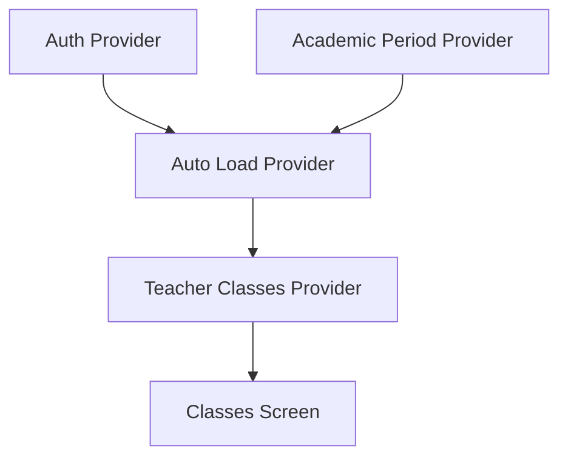

# Teacher Classes Loading Fix Plan

## Current Issue
- Teacher classes screen shows infinite loading
- Data is never fetched from the backend
- No automatic triggering of initial load

## Root Causes
1. TeacherClassesNotifier starts in loading state but never triggers initial load
2. No connection between auth provider and classes provider
3. Missing error handling for edge cases

## Implementation Plan

### 1. Modify TeacherClassesProvider

Current issues:
- Starts in loading state without data fetch
- No automatic initialization
- Manual load required

Required changes:
```dart
// Create a combined provider to handle initialization
final teacherClassesAutoLoadProvider = Provider<void>((ref) {
  final authState = ref.watch(authStateProvider);
  final currentPeriod = ref.watch(currentAcademicPeriodProvider);
  
  if (authState.isAuthenticated && currentPeriod != null) {
    ref.read(teacherClassesProvider.notifier).loadClasses(
      authState.user!.id,
      currentPeriod
    );
  }
});
```

### 2. Update ClassesScreen

Current issues:
- Only watches classes provider
- No initialization trigger
- Missing error states

Required changes:
- Add provider watch for automatic loading
- Improve error handling
- Add loading state feedback

### 3. Error Handling Improvements

Add specific error handling for:
- Missing teacher ID
- Invalid academic period
- Network failures
- Database query errors

### 4. Data Flow



### 5. Testing Plan

1. Test initialization:
   - With valid teacher ID
   - With missing teacher ID
   - With different academic periods

2. Test error scenarios:
   - Network failures
   - Database errors
   - Invalid data

3. Test state transitions:
   - Loading -> Success
   - Loading -> Error
   - Error -> Success

## Migration Steps

1. Create new provider implementation
2. Update screen to use auto-loading
3. Add comprehensive error handling
4. Test all scenarios
5. Deploy changes

## Next Steps

1. Switch to Code mode to implement changes
2. Start with TeacherClassesProvider modifications
3. Update UI components
4. Add error handling
5. Test implementation