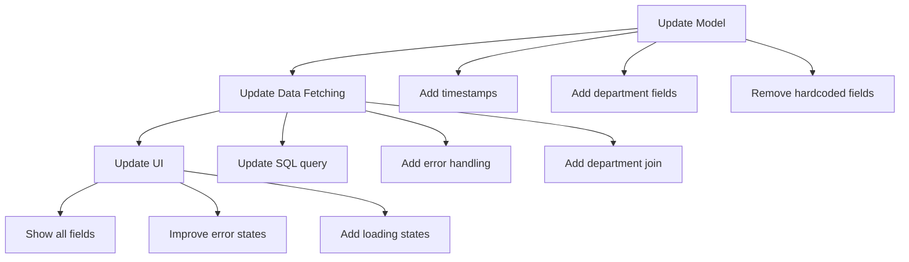

# Teacher Profile Implementation Plan

## Current Implementation vs Database Schema

### Database Schema
```sql
-- Profiles table (base table)
CREATE TABLE profiles (
    id UUID PRIMARY KEY REFERENCES auth.users,
    first_name VARCHAR(50) NOT NULL,
    last_name VARCHAR(50) NOT NULL,
    role VARCHAR(20) CHECK (role IN ('admin', 'teacher', 'student')),
    phone VARCHAR(20),
    created_at TIMESTAMP WITH TIME ZONE DEFAULT CURRENT_TIMESTAMP,
    updated_at TIMESTAMP WITH TIME ZONE DEFAULT CURRENT_TIMESTAMP
);

-- Teacher profiles table
CREATE TABLE teacher_profiles (
    id UUID PRIMARY KEY REFERENCES profiles(id),
    department_id UUID REFERENCES departments(id),
    employee_id VARCHAR(20) UNIQUE NOT NULL,
    created_at TIMESTAMP WITH TIME ZONE DEFAULT CURRENT_TIMESTAMP,
    updated_at TIMESTAMP WITH TIME ZONE DEFAULT CURRENT_TIMESTAMP
);

-- Departments table 
CREATE TABLE departments (
    id UUID PRIMARY KEY DEFAULT uuid_generate_v4(),
    name VARCHAR(100) NOT NULL,
    code VARCHAR(10) UNIQUE NOT NULL,
    created_at TIMESTAMP WITH TIME ZONE DEFAULT CURRENT_TIMESTAMP,
    updated_at TIMESTAMP WITH TIME ZONE DEFAULT CURRENT_TIMESTAMP
);
```

### Current Implementation Gaps

1. Model Level
   - Missing timestamps (created_at, updated_at)
   - Department name not included (only has department_id)
   - Position field is hardcoded as "Teacher"
   - Specialization field is always null
   - Department code not included

2. Data Fetching Level
   - No join with departments table to get department name and code
   - Timestamps not included in query
   - No error handling for missing department

3. UI Level
   - Department displayed as null
   - No timestamps shown
   - Shows hardcoded position
   - Shows null specialization
   - Basic error handling without specific error messages

## Implementation Plan



### 1. Model Updates

Update TeacherProfile model to include all fields from database:

```dart
class TeacherProfile {
  final String id;
  final String firstName;
  final String lastName;
  final String employeeId;
  final String? phone;
  final String departmentId;
  final String departmentName;    // Added
  final String departmentCode;    // Added
  final DateTime createdAt;       // Added
  final DateTime updatedAt;       // Added

  // Remove position and specialization fields as they're not in DB
}
```

### 2. Data Fetching Updates

Update the query in TeacherProfileProvider:

```sql
SELECT 
  tp.id,
  tp.employee_id,
  tp.department_id,
  tp.created_at,
  tp.updated_at,
  p.first_name,
  p.last_name,
  p.phone,
  d.name as department_name,
  d.code as department_code
FROM teacher_profiles tp
JOIN profiles p ON tp.id = p.id
JOIN departments d ON tp.department_id = d.id
WHERE tp.id = :userId
```

Add proper error handling:
- Handle missing department
- Handle database connection errors
- Add specific error messages

### 3. UI Updates

Update ProfileScreen:

1. Information Display
   - Add department name and code display
   - Add account creation date
   - Remove position and specialization sections
   - Format dates appropriately

2. Error Handling
   - Show specific error messages
   - Add retry functionality
   - Improve error UI

3. Loading States
   - Add shimmer loading effect
   - Show loading indicators for specific sections

## Implementation Steps

1. Model Layer
   - Update TeacherProfile class
   - Update fromJson constructor
   - Add proper typing for all fields
   - Add tests for model serialization

2. Provider Layer
   - Update SQL query
   - Add error handling
   - Add logging for debugging
   - Add tests for data fetching

3. UI Layer
   - Update profile screen layout
   - Add error handling components
   - Add loading states
   - Add tests for UI components

## Testing Plan

1. Unit Tests
   - Model serialization/deserialization
   - Data fetching error handling
   - Date formatting

2. Widget Tests
   - Loading states
   - Error states
   - Data display

3. Integration Tests
   - Full profile loading flow
   - Error scenarios
   - Navigation

Would you like me to switch to code mode to start implementing these changes?