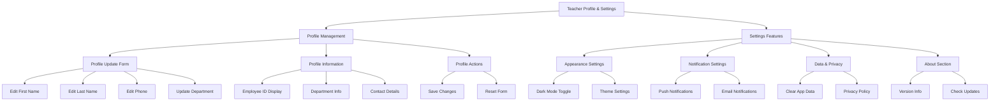

# Teacher Profile and Settings Implementation Plan

This document outlines the plan for implementing teacher profile updates and settings functionality, mirroring the student-side features while adapting them for teacher-specific needs.

## Architecture Overview



## Implementation Details

### 1. Profile Update Features

#### Profile Edit Form
- Create form with the following fields:
  * First Name (required)
  * Last Name (required)
  * Phone Number (optional)
  * Department Selection (required)
- Add field validation:
  * Required field checks
  * Phone number format validation
  * Real-time validation feedback
- Implement form actions:
  * Save button with loading state
  * Reset form button
  * Cancel editing option

#### Database Integration
- Update profile in Supabase:
  * Update profiles table
  * Update teacher_profiles table
  * Handle department associations
- Implement error handling:
  * Network errors
  * Validation errors
  * Constraint violations

#### UI/UX Components
- Loading states:
  * Form submission spinner
  * Save button loading state
  * Field disabled states during submission
- Success/Error feedback:
  * Toast notifications
  * Inline error messages
  * Success confirmation dialog

### 2. Settings Implementation

#### Appearance Settings
- Dark Mode Toggle:
  * Sync with system theme
  * Persist preference
  * Real-time theme switching
- Theme Customization:
  * Color scheme selection
  * UI density options
  * Font size preferences

#### Notification Settings
- Push Notifications:
  * Class schedule alerts
  * Attendance reminders
  * System announcements
- Email Notifications:
  * Weekly summaries
  * Important announcements
  * Account activity

#### Data & Privacy
- App Data Management:
  * Clear cache option
  * Reset preferences
  * Export data option
- Privacy Features:
  * Privacy policy viewer
  * Data usage information
  * Consent management

#### About Section
- Version Information:
  * Current version display
  * Build number
  * Release notes
- Update Management:
  * Check for updates
  * Update notifications
  * Changelog viewer

### 3. State Management

#### Profile State
- TeacherProfileNotifier extensions:
  ```dart
  class TeacherProfileNotifier {
    Future<void> updateProfile(TeacherProfile profile);
    Future<void> updateDepartment(String departmentId);
    Future<void> updateContactInfo(String phone);
  }
  ```

#### Settings State
- New providers:
  ```dart
  final teacherSettingsProvider = StateNotifierProvider<TeacherSettingsNotifier, TeacherSettings>
  final teacherNotificationSettingsProvider = StateNotifierProvider<NotificationSettingsNotifier, NotificationSettings>
  ```

### 4. UI Components Needed

#### New Components
- ProfileEditForm
- DepartmentSelector
- SettingsSection
- NotificationPreferences
- PrivacySettings
- AboutSection

#### Reusable Components
- SectionHeader
- SettingsCard
- ToggleOption
- ActionButton
- LoadingOverlay

## Implementation Phases

1. **Phase 1: Core Profile Updates**
   - Profile edit form
   - Database integration
   - Basic validation
   - Error handling

2. **Phase 2: Settings Framework**
   - Settings screen structure
   - Dark mode toggle
   - Basic preferences

3. **Phase 3: Enhanced Features**
   - Notification settings
   - Data management
   - Privacy features

4. **Phase 4: Polish & Optimization**
   - Loading states
   - Animations
   - Error recovery
   - Performance optimization

## Success Metrics

- Profile update success rate
- Settings persistence accuracy
- User interaction metrics
- Error occurrence rate
- Response time measurements

## Next Steps

1. Set up development environment
2. Create necessary database migrations
3. Implement core profile functionality
4. Add settings framework
5. Test and validate all features
6. Gather user feedback
7. Iterate and improve based on feedback