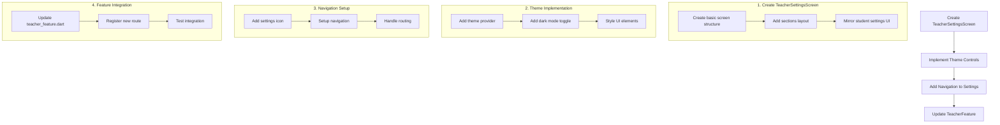

# Teacher Theme Implementation Plan

## Overview
This plan outlines the steps needed to apply the existing theme functionality from the student side to the teacher side of the application. The goal is to provide teachers with the same theme control capabilities that students currently have.

## Current State
- A centralized theme provider exists with enhanced light/dark themes
- Student side has a settings screen with theme controls
- Teacher side is missing a settings screen for theme control

## Implementation Flow

## Detailed Implementation Steps

1. **Create TeacherSettingsScreen**
   - Create new file `lib/features/teacher/screens/teacher_settings_screen.dart`
   - Mirror the structure of StudentSettingsScreen for consistency
   - Include sections for Appearance, Notifications, Data & Privacy, and About
   - Ensure proper theming of all UI elements

2. **Theme Controls Implementation**
   - Import and use the existing themeProvider
   - Implement dark mode toggle with the same logic as student side
   - Apply theme colors to icons and text elements
   - Ensure proper theme application across all widgets

3. **Navigation Setup**
   - Add a settings icon to the teacher's main navigation
   - Set up proper routing to the settings screen
   - Ensure smooth navigation transitions

4. **Feature Integration**
   - Update teacher_feature.dart to include the new settings screen
   - Register the new route in the feature's route configuration
   - Test the integration to ensure everything works smoothly

## Quality Assurance

- Test theme switching in both light and dark modes
- Verify UI consistency with student side
- Ensure proper state management
- Test navigation flow

## Technical Notes

- Reuse existing theme_provider.dart functionality
- Maintain consistent UI/UX between student and teacher interfaces
- Follow existing project architecture patterns
- Ensure proper error handling for theme changes