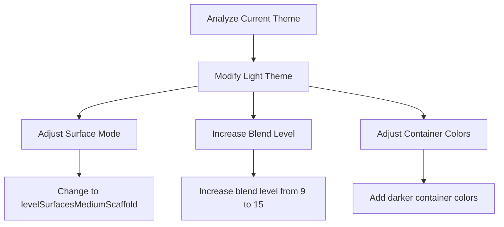

# Light Theme Enhancement Plan

## Current Issue
The light theme in the student part of the application is too bright, making it potentially uncomfortable for users.

## Analysis
The current implementation uses:
- FlexColorScheme with Material 3
- Surface mode: `FlexSurfaceMode.levelSurfacesLowScaffold`
- Blend level: 9 (relatively low)
- Primary colors: 
  - Primary: #6AB19B
  - Secondary: #7DCFB6
- Container opacity: 0.85

## Proposed Changes



### Detailed Implementation Plan

1. Modify Surface Mode
   - Change from `FlexSurfaceMode.levelSurfacesLowScaffold` to `FlexSurfaceMode.levelSurfacesMediumScaffold`
   - This will create better contrast between different surface levels
   - Impact: More distinct separation between UI elements

2. Adjust Blend Levels
   - Increase `blendLevel` from 9 to 15
   - Increase `blendOnLevel` from 10 to 15
   - Impact: Better depth perception and reduced brightness

3. Enhance Container Colors
   - Increase container opacity from 0.85 to 0.9
   - Add subtle background tinting
   - Impact: Improved visibility and reduced eye strain

### Code Changes Required

The changes will be made in `lib/features/theme/providers/theme_provider.dart`:

1. Update the light theme configuration:
```dart
return FlexThemeData.light(
  colors: FlexSchemeColor(
    primary: const Color(0xFF6AB19B),
    primaryContainer: const Color(0xFF6AB19B).withOpacity(0.9), // Increased opacity
    secondary: const Color(0xFF7DCFB6),
    secondaryContainer: const Color(0xFF7DCFB6).withOpacity(0.9), // Increased opacity
  ),
  surfaceMode: FlexSurfaceMode.levelSurfacesMediumScaffold, // Changed surface mode
  blendLevel: 15, // Increased blend level
  subThemesData: const FlexSubThemesData(
    blendOnLevel: 15, // Increased blend on level
    // ... rest of the configuration remains same
  ),
)
```

## Expected Outcome
- Reduced brightness in the student interface
- Better visual hierarchy
- Improved readability
- Maintained consistency with the app's design language
- More comfortable viewing experience

## Testing Plan
1. Test the theme changes across different student screens
2. Verify contrast ratios meet accessibility standards
3. Validate readability of text on all surfaces
4. Ensure visual hierarchy is maintained
5. Check compatibility with dark mode switching